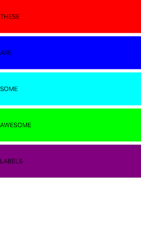
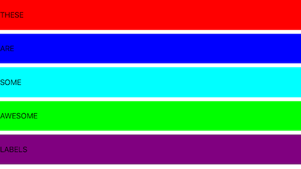

# AutoLayout
This repo follows Project 6 tutorial on www.hackingwithswift.com, specifically Auto Layout in code.  The goal is to understand Auto Layout in Xcode and also how to define layouts using Auto Layout Visual Format Language(VFL).





## Concepts Learned/Practiced
* Dictionaries - key/value pairs
  * Example from project, creating dictionary of views we want laid out:
    ```
    let viewsDictionary = [
    "label1": label1,
    "label2": label2,
    "label3": label3,
    "label4": label4,
    "label5": label5
    ]
    ```
* Auto Layout Visual Format Language(VFL) - Essentially defining layout in code
 * Example:
    ```
    for label in viewsDictionary.keys {
      view.addConstraints(NSLayoutConstraint.constraintsWithVisualFormat("H:|[\(label)]|", options: [], metrics: nil, views:viewsDictionary))
    }
    ```

## Attributions
* [Project 6: Auto Layout tutorial @ hackingwithswift.com](https://www.hackingwithswift.com/read/6/overview)
